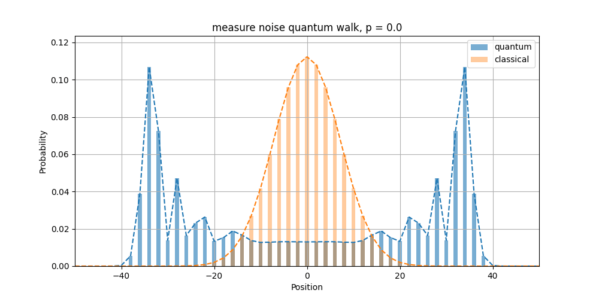
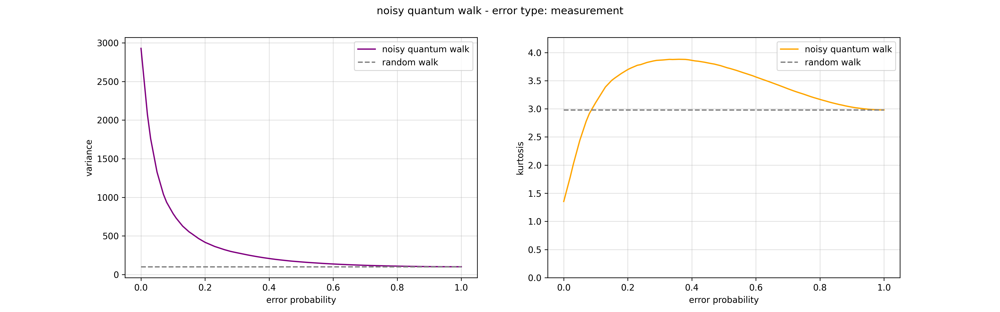
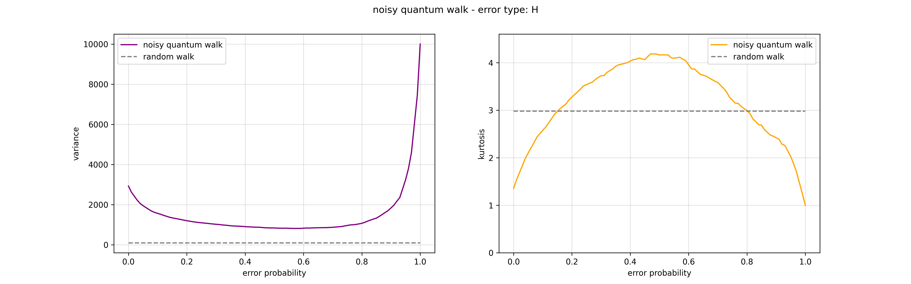
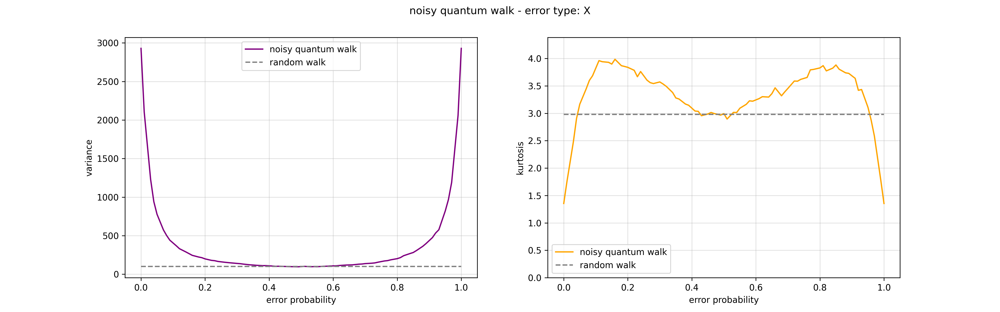
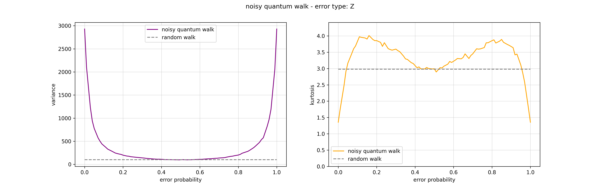

# noisy-quantum-walks-thesis
everything I made for my bachelor degree's thesis about [random walks](https://en.wikipedia.org/wiki/Random_walk), [quantum random walks](https://en.wikipedia.org/wiki/Quantum_walk) and noisy quantum walks

## about noisy quantum walk
with this project I provide an analysis of the quantum random walk's probability distributions under the effect of many noisy environments, with different error probabilities.  

